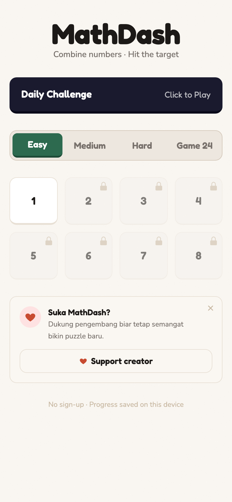
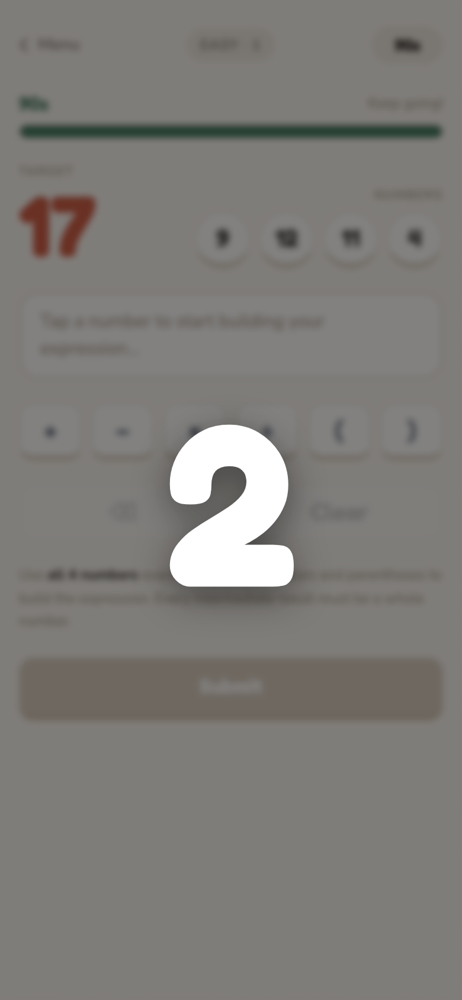
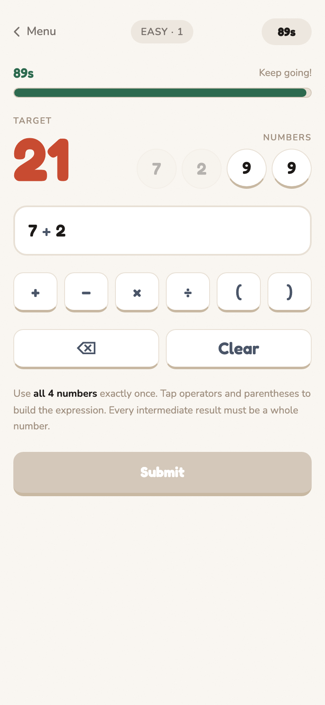
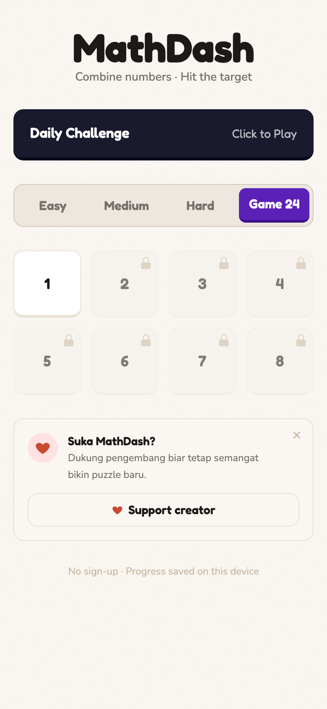
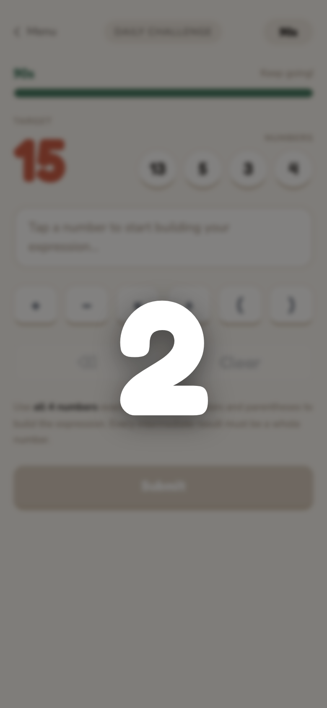

# MathDash 🧮

A zero-friction, browser-based math puzzle game. Combine 4 number tiles using **+, −, ×, ÷** to hit the target before the timer runs out — no install, no account, just play.

[](https://lynk.id/praaad)

---

## How to Play

1. You're given **4 number tiles** and a **target number**
2. Tap a tile → tap an operator → tap another tile → they merge into one result tile
3. Repeat until **one tile remains** — if it equals the target, you win!
4. All 4 numbers **must** be used. Faster solves earn more ⭐

---

## Screenshots

<p align="center">
  
  
  
</p>
<p align="center">
  
  
</p>

---

## Game Modes

| Mode | Timer | Numbers | Target |
|---|---|---|---|
| **Easy** | 90s | 1 – 13 | 6 – 100 |
| **Medium** | 60s | 1 – 13 | 6 – 100 |
| **Hard** | 60s | 1 – 13 | 6 – 999 |
| **Game 24** | 90s | 1 – 9 | always 24 |
| **Daily** | 90s | 1 – 13 | 6 – 100, seeded by date |

### Scoring

Stars are awarded based on how much time is left when you solve the puzzle:

- ⭐⭐⭐ — more than 66% time remaining
- ⭐⭐ — more than 33% time remaining
- ⭐ — solved (any time)

---

## Features

- **Daily Challenge** — one shared puzzle per UTC date with a streak counter
- **Result Card** — share your solve as a PNG image (rendered client-side via Canvas API)
- **Progress persistence** — your stars and streak are saved in `localStorage`; no account needed
- **All levels unlocked** — no paywalls, no lock mechanics
- **Works offline** — fully static, no backend

---

## Tech Stack

| Layer | Technology |
|---|---|
| Framework | React 18 + TypeScript |
| Build | Vite 6 |
| Routing | react-router-dom v6 |
| State | Zustand (progress persisted; session in-memory) |
| Styling | Tailwind CSS v4 |
| Testing | Vitest + Testing Library |

No backend. No database. No analytics (yet). Client-only SPA.

---

## Getting Started (Developer)

### Prerequisites

- Node.js ≥ 18
- [pnpm](https://pnpm.io/) (recommended) or npm

### Install & Run

```bash
# Clone the repo
git clone <repo-url>
cd Game24

# Install dependencies
pnpm install

# Start dev server
pnpm dev
```

### Other Commands

```bash
pnpm build          # Production build → dist/
pnpm preview        # Preview the production build locally
pnpm test           # Run tests (Vitest)
pnpm test:watch     # Run tests in watch mode
```

### Project Structure

```
src/
├── routes/         # Page components (Home, Play, DailyPlay, Share)
├── components/     # Presentational UI components
├── engine/         # Pure game logic (expression, solver, puzzle, daily)
├── store/          # Zustand stores (progress, session)
├── lib/            # Utilities (PRNG, canvas share, classname helper)
└── data/
    └── levels.json # Level slot metadata (32 entries, 8 per tier)
```

Puzzles (numbers + target) are **generated at runtime** — `levels.json` only stores metadata like `tier`, `index`, and `timeLimitSec`.

---

## Architecture Notes

- **Expression engine** (`engine/expression.ts`) — token-based evaluation; enforces integer-only division during play
- **Solver** (`engine/solver.ts`) — exhaustive permutation search; guarantees every generated puzzle is solvable
- **Daily puzzle** (`engine/daily.ts`) — deterministic from a date-seeded PRNG ([mulberry32](src/lib/prng.ts)); same puzzle for all players on the same UTC date
- **Share card** (`lib/canvas-share.ts`) — rendered to an offscreen canvas and exported as PNG; no server involved

---

## Support the Creator

If you enjoy MathDash, consider supporting continued development:

[](https://lynk.id/praaad)

Your support helps keep new puzzles and features coming. 🙏

---

## Roadmap (Post-v1)

- [ ] Global leaderboard
- [ ] Server-synced daily stats ("12% of players solved today")
- [ ] Hint system (costs 1 star)
- [ ] Expression history log on the play screen
- [ ] Sound effects and haptics
- [ ] PWA install + offline mode
- [ ] Tile-combine animations

---

## Contributing

This project is in active development. Bug reports and suggestions are welcome via issues.

Before submitting a PR, run:

```bash
pnpm test
pnpm build
```

Make sure both pass without errors.
